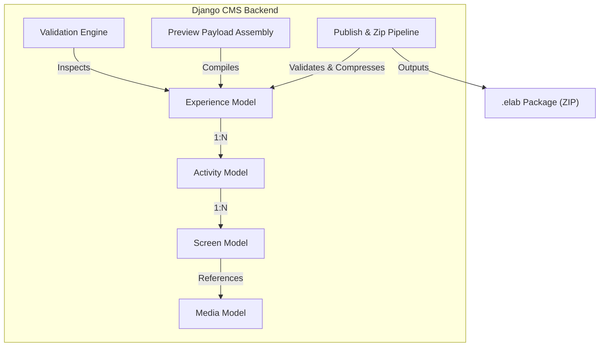

# Language Lab CMS Backend System Handover Report

This document outlines the architecture, data models, endpoints, roles, and deployment configurations of the Language Lab CMS backend system (Phases 1–7), reflecting all recent updates including API versioning.

---

## 1. System Overview & Architecture

The Language Lab CMS is a role-based educational content management system. It compiles learning materials into offline-compatible `.elab` packages, which are consumed by an Electron-based offline desktop LMS.



The Content Studio is a **global platform system** (not school-scoped), allowing authors to write educational paths without school boundaries, whereas schools and users (teachers/students/school admins) are structured inside strict organizational tenants.

### Key Metrics & Status
* **API Versioning**: Enforced `/api/cms/v1/` for all school-side administration endpoints. Content Studio remains at `/api/v1/content/`, and Assessments are handled under `/api/v1/sync/` and `/api/v1/reports/`.
* **Testing Status**: 94 tests passing cleanly. End-to-end (E2E) verification completed.
* **Seed Data**: Fully updated to realistic, production-ready names (e.g., `TIME Matriculation Higher Secondary School` and `St. Joseph's Higher Secondary School` instead of placeholder names).

---

## 2. Django Apps & Models

### A. Accounts (`accounts/`)
Manages users, permissions, and session authentication.
* **User**: Core model with roles (`SUPER_ADMIN`, `CONTENT_CREATOR`, `SCHOOL_ADMIN`, `TEACHER`, `STUDENT`).

### B. Content Studio (`content_studio/`)
Encapsulates all Experience creation, assets, validation, and packaging features.
* **Experience**: Learning paths (e.g., Difficulty, Estimated Duration, Subject, Grade).
* **Activity**: Reorderable steps within an Experience.
* **Screen**: Layouts containing markdown and learning interactions (content JSON).
* **Media**: Tracked uploaded assets (images, video, audio, PDFs).
* **LearningOutcome**: Map experiences to specific goals.
* **ValidationReport**: Stores results of validation checks.
* **PublishedPackage**: Experience mapping table for generated versions.
* **PublishVersion**: Unique package iterations storing SHA-256 and `.elab` file paths.
* **Notification**: User activity alerts.

### C. Assessments & Sync (`assessments/`)
Syncs student evaluations and generates overview/performance analytics.
* **ExperienceAssignment**: Links experiences to classes.
* **StudentAttempt**: Track student progression, total score, time spent, and completion status.
* **ScreenResponse**: Stores individual student answers for each screen in an experience.

---

## 3. Role Permission Matrix

The system enforces role-based access control. All Content Studio APIs are protected at the view and router levels, while school-side models are strictly scoped based on the administrator's school association.

| Endpoint Group | Super Admin | Content Creator | School Admin | Teacher | Student |
| :--- | :---: | :---: | :---: | :---: | :---: |
| **School Administration** | Read / Write | ❌ | ❌ | ❌ | ❌ |
| **School Admin Accounts** | Read / Write | ❌ | ❌ | ❌ | ❌ |
| **Teacher Accounts** | Read / Write | ❌ | Read / Write (Scoped) | ❌ | ❌ |
| **Class Records** | Read / Write | ❌ | Read / Write (Scoped) | Read-Only | ❌ |
| **Class Assignments** | Read / Write | ❌ | Read / Write (Scoped) | Read-Only | ❌ |
| **Student Accounts** | Read / Write | ❌ | Read / Write (Scoped) | Read / Write (Scoped) | ❌ |
| **Experience CRUD** | Read / Write | Read / Write | ❌ | ❌ | ❌ |
| **Media Library CRUD** | Read / Write | Read / Write | ❌ | ❌ | ❌ |
| **Validation Engine** | Run / View | Run / View | ❌ | ❌ | ❌ |
| **Runtime Preview** | Run / View | Run / View | ❌ | ❌ | ❌ |
| **Publishing Pipeline** | Run / Download | Run / Download | ❌ | ❌ | ❌ |
| **Assessment Sync** | ❌ | ❌ | ❌ | ❌ | Sync Only (LMS) |
| **Reports Overview** | View All | ❌ | View Scoped | View Scoped | ❌ |

---

## 4. Complete Endpoint Reference

### A. School-Side Endpoints (`/api/cms/v1/`)

All school administration endpoints are grouped under the `v1` CMS prefix:

| Endpoint | Methods | Description | Auth |
| :--- | :--- | :--- | :--- |
| `/api/cms/v1/grades/` | `GET`, `POST` | List and create grade levels. | Authenticated |
| `/api/cms/v1/grades/{id}/` | `GET`, `PUT`, `PATCH`, `DELETE` | Retrieve, update, or delete a grade level. | Authenticated |
| `/api/cms/v1/schools/` | `GET`, `POST` | List and create schools. | Super Admin Only |
| `/api/cms/v1/schools/{id}/` | `GET`, `PUT`, `PATCH`, `DELETE` | Retrieve, update, or delete a school record. | Super Admin Only |
| `/api/cms/v1/teachers/` | `GET`, `POST` | List and create teacher profiles. Supports class link array. | School Admin / SA |
| `/api/cms/v1/teachers/{id}/` | `GET`, `PUT`, `PATCH`, `DELETE` | Retrieve, update, or delete a teacher profile. | School Admin / SA |
| `/api/cms/v1/classes/` | `GET`, `POST` | List and create classes. Supports teacher link array. | School Admin / SA |
| `/api/cms/v1/classes/{id}/` | `GET`, `PUT`, `PATCH`, `DELETE` | Retrieve, update, or delete a class. | School Admin / SA |
| `/api/cms/v1/teacher-classes/` | `GET`, `POST` | Class assignments lookup. | School Admin / SA |
| `/api/cms/v1/teacher-classes/{id}/` | `GET`, `PUT`, `PATCH`, `DELETE` | Retrieve, update, or delete class assignments. | School Admin / SA |
| `/api/cms/v1/students/` | `GET`, `POST` | List and create students. | Teacher / School Admin / SA |
| `/api/cms/v1/students/{id}/` | `GET`, `PUT`, `PATCH`, `DELETE` | Retrieve, update, or delete a student. | Teacher / School Admin / SA |
| `/api/cms/v1/school-admins/` | `GET`, `POST` | List and create school administrators. | Super Admin Only |
| `/api/cms/v1/school-admins/{id}/` | `GET`, `PUT`, `PATCH`, `DELETE` | Retrieve, update, or delete a school administrator. | Super Admin Only |
| `/api/cms/v1/dashboard-stats/` | `GET` | Retrieve key summary stats for Super Admin dashboard. | Super Admin Only |

### B. Content Studio Endpoints (`/api/v1/content/`)

All learning content authoring endpoints reside under the `/api/v1/content/` namespace:

| Endpoint | Methods | Description |
| :--- | :--- | :--- |
| `/api/v1/content/scenarios/` | `GET`, `POST` | List and create content experiences (scenarios). |
| `/api/v1/content/scenarios/{id}/` | `GET`, `PUT`, `PATCH`, `DELETE` | Retrieve, update, or delete a scenario. |
| `/api/v1/content/scenarios/reorder-activities/` | `POST` | Atomically shift display orders of activities. |
| `/api/v1/content/activities/` | `GET`, `POST` | List and create activities. |
| `/api/v1/content/activities/{id}/` | `GET`, `PUT`, `PATCH`, `DELETE` | Retrieve, update, or delete an activity. |
| `/api/v1/content/activities/reorder-screens/` | `POST` | Shift display orders of screens. |
| `/api/v1/content/screens/` | `GET`, `POST` | List and create screens. |
| `/api/v1/content/screens/{id}/` | `GET`, `PUT`, `PATCH`, `DELETE` | Retrieve, update, or delete a screen. |
| `/api/v1/content/screens/{id}/duplicate/` | `POST` | Duplicate a screen. |
| `/api/v1/content/media/` | `GET` | List and filter uploaded media assets. |
| `/api/v1/content/media/upload/` | `POST` | Secure multipart media file upload. |
| `/api/v1/content/media/{id}/replace/` | `POST` | Replace a media file binary dynamically. |
| `/api/v1/content/media/{id}/` | `DELETE` | Delete media (fails if referenced by screens). |
| `/api/v1/content/media/{id}/usage/` | `GET` | Get screens referencing this asset. |
| `/api/v1/content/validation/{scenario_id}/run/` | `POST` | Run validation suite checking metadata, media, structure. |
| `/api/v1/content/validation/{scenario_id}/` | `GET` | Return latest validation report. |
| `/api/v1/content/scenarios/{id}/preview/` | `GET` | Assembly runtime preview payload (absolute server URLs). |
| `/api/v1/content/publish/{scenario_id}/` | `POST` | Compile metadata relative URLs, bundle package as `.elab` zip. |
| `/api/v1/content/packages/{id}/download/` | `GET` | Stream download of the generated `.elab` package. |
| `/api/v1/content/dashboard/summary/` | `GET` | Studio summary dashboard metrics. |

### C. Assessment Endpoints (`/api/v1/`)

Endpoints for LMS evaluations sync and data reporting:

| Endpoint | Methods | Description |
| :--- | :--- | :--- |
| `/api/v1/sync/assignments/` | `POST` | Sync LMS class assignments metadata. |
| `/api/v1/sync/attempts/` | `POST` | Sync LMS student attempt records. |
| `/api/v1/sync/responses/` | `POST` | Sync LMS student response logs. |
| `/api/v1/reports/overview/` | `GET` | School overview reporting summary. |
| `/api/v1/reports/scenarios/` | `GET` | Per-experience performance aggregates. |
| `/api/v1/reports/classes/` | `GET` | Per-class evaluations performance. |
| `/api/v1/reports/students/` | `GET` | Per-student analytics overview. |
| `/api/v1/reports/export/` | `GET` | Export reports as CSV. |

---

## 5. Security & Isolation Controls

The system has passed 15/15 comprehensive isolation and regression test cases:

1. **School-Scoping Tenant Isolation**: All endpoints for `teachers`, `students`, `classes`, and `reports` dynamically extract the school ID of the logged-in administrator or teacher and enforce strict filters, preventing cross-tenant leakage.
2. **File Upload Verification**: Safe binary verification checks magic bytes (preventing file renaming spoofing), enforces SVG sanitization to block XSS vector files, and restricts files to pre-configured limits.
3. **JWT Authentication & Rotation**: Token authentication is driven by `django-rest-framework-simplejwt`, enforcing short-lived access tokens and single-use refresh token rotation.
4. **Soft Delete**: Prevents accidental data destruction by marking deleted scenario records inside the Content Studio, allowing administrative rollback.

---

## 6. Database Schema (10 Main Tables)

* **`cms_school`**: School name, address, phone, email, and active status.
* **`cms_grade`**: Name, description, sorting sequence order.
* **`cms_class`**: Class name, grade relation, school relation, academic year.
* **`cms_student`**: Student profiles referencing core Django users and schools.
* **`cms_teacher`**: Teacher qualifications, experience, and school association.
* **`cms_teacherclass`**: Many-to-many relationship mapping classes to teachers.
* **`cms_schooladminprofile`**: School administrator profiles linked to specific schools.
* **`cms_experience_assignment`**: Maps experiences to classes with assignments dates.
* **`cms_student_attempt`**: Stores student completion state, scores, and duration.
* **`cms_screen_response`**: Logged interaction details for screens in attempts.

---

## 7. Local Setup & Verification

### Prerequisites
* Python 3.10+
* PostgreSQL database

### Installation Steps
1. Navigate to the backend directory:
   ```bash
   cd backend/
   ```
2. Copy and set up environment credentials:
   ```bash
   cp .env.example .env
   ```
3. Initialize migrations and seed database:
   ```bash
   python manage.py migrate
   python manage.py link_seed_accounts
   ```
4. Start the server:
   ```bash
   python manage.py runserver
   ```

### Running Verification Tests
Execute the backend test suite:
```bash
python manage.py test
```
*Expected outcomes*: **94 tests passing cleanly (100% OK)**.

---

## 8. Setup & Production Checklist

Before production release, confirm:
1. **`DEBUG = False`**: Set in the production `.env` file to prevent tracebacks.
2. **`ALLOWED_HOSTS`**: Explicitly set to target production domain names.
3. **`CORS_ALLOWED_ORIGINS`**: Specified explicitly, wildcards disabled.
4. **Media Handoff**: Configure Nginx or Amazon S3 to serve the `/media/` folder directly.
5. **Packages Directory**: Map `PACKAGES_ROOT` to a secure, persistent external volume.
